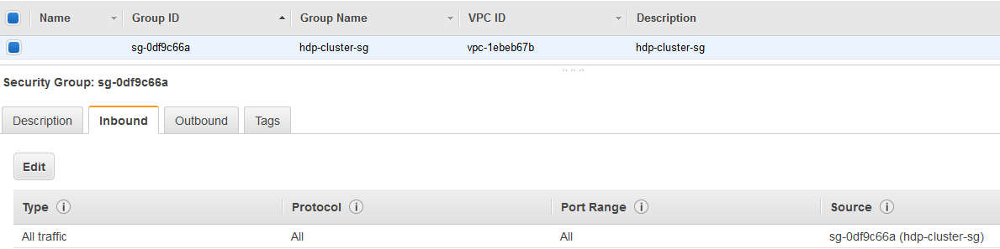

# Task 1 - AWS HDP Cluster
This documentation provides the steps to create a 3 nodes HDP cluster using AWS. We are first going to prepare a base image that contains the minimal configuration needed by the nodes. All the nodes will then be spawned using this image (to avoid manually replicating this configuration for every node). Afteward, each node is going to be configured specifically.

## Prepare the base image
The goal of this step is to create a base image that contains the minimal configuration for all the nodes of the HDP cluster. The minimal configuration concerned by this image consists of :
- passwordless SSH between all the nodes
- setting ulimits to 10000
- installing and enabling ntp
- disabling firewalld : not necessary in AWS as we will be using security groups (this step will be skipped)
- disabling selinux
- setting umask to 022

#### Prerequisites
Create a security group that enables all connection protocols to itself. All the machines will be using this security group (this step is equivalent to disabling firewalld or iptables but only between the nodes of the cluster).



#### Steps
Here are the steps
- create a t2.medium redhat instance with a 50GB EBS volume and connect to that machine.
- execute the following commands :
```bash
# configuring ulimit
sudo sh -c 'echo "* soft nofile 10000" >> /etc/security/limits.conf'
sudo sh -c 'echo "* hard nofile 10000" >> /etc/security/limits.conf'
# set up passwordless SSH :
ssh-keygen -f ~/.ssh/id_rsa -t rsa -N ''
cat ~/.ssh/id_rsa.pub >> ~/.ssh/authorized_keys
# installing ntp
sudo yum install ntp
sudo systemctl enable ntpd
sudo systemctl start ntpd
# disabling SELINUX
sudo setenforce 0
sudo sed -i 's/SELINUX=.*/SELINUX=disabled/g' /etc/selinux/config
# setting umask to 022
sudo sh -c 'echo "umask 022" >> /etc/profile'
```

- reboot the instance and check if everything is OK
    - is ntp enabled : `sudo systemctl is-enabled ntpd`
    - is umask equals to 022 : `umask`
    - is ulimut equals to 10000 : `ulimit -n`
- create an image from this instance

### Creating the cluster
- Instantiate 3 m4.xlarge nodes from the image created previously and name them : master, node1, node2. All the images must be in the security group created previously. 
- add the private DNS entries of all the nodes in the /etc/hosts (a real DNS system should be used instead in production like route53). For this, execute the following command on each node (after replacing the IPs and DNS entries by the correct ones) :
```bash
sudo su -
cat >> /etc/hosts <<-HOSTS
172.31.23.137   ip-172-31-23-137.eu-west-1.compute.internal node2
172.31.23.136   ip-172-31-23-136.eu-west-1.compute.internal node1
172.31.2.53     ip-172-31-2-53.eu-west-1.compute.internal master
HOSTS
```
- Install Ambari on the 'Master' machine :
```bash
sudo yum install wget
sudo wget -nv http://public-repo-1.hortonworks.com/ambari/centos7/2.x/updates/2.2.2.0/ambari.repo -O /etc/yum.repos.d/ambari.repo
sudo yum install ambari-server
sudo ambari-server setup
sudo ambari-server start
```
- connect to Ambari using the public DNS of the 'Master' machine : `http://public-dns:8080`

curl -H "X-Requested-By: ambari" -X GET -u admin:admin http://c6401.ambari.apache.org:8080/api/v1/blueprints

### Optional - Using volumes
In order for me not to make the cluster creation too expensive, I didn't mount any additional volumes. In production deployments, it is recommended to use dedicated volumes on nodes that writes a lot of data like datanodes. It's both recommended for performance and for safety. 

To mount a volume on the instance (first, you have to attach a volume when creating the instance)
- mount volume :
```bash
sudo mkfs -t ext4 /dev/xvdb
sudo mkdir /grid
sudo mount /dev/xvdb /grid
```
- update fstab : `vi fstab`
  - add an `a` at the end of the first line
  - add : `/dev/xvdb  /grid ext4  defaults,nofail 0 2`
- reboot
- verify :
  - `df -h` : list mounts
  - `lsblk` : list attached volumes